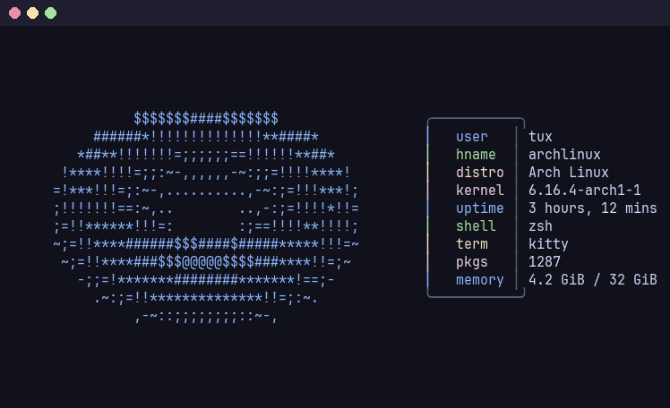
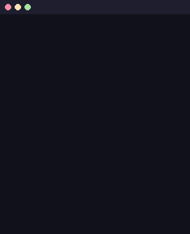
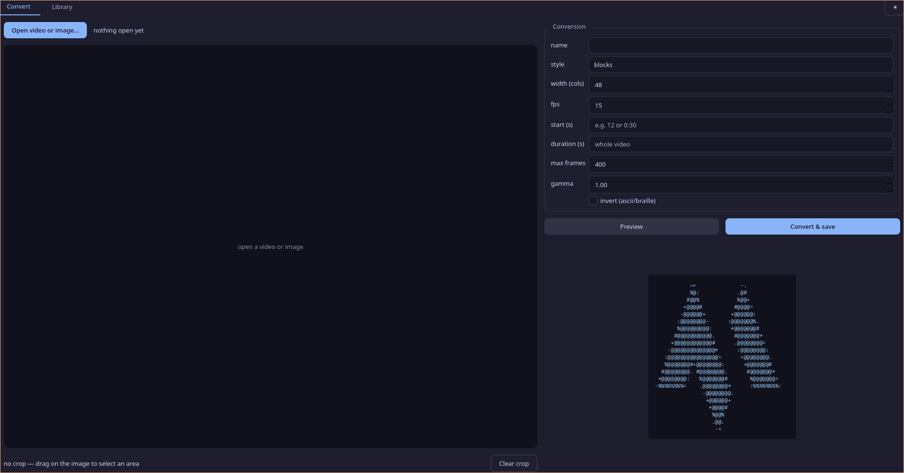
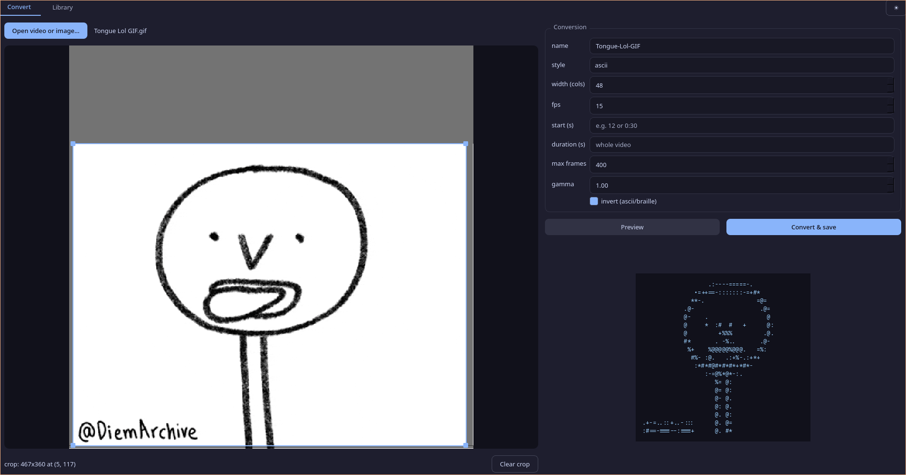
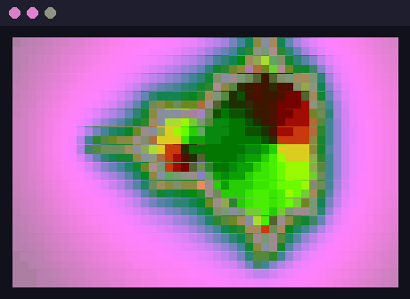
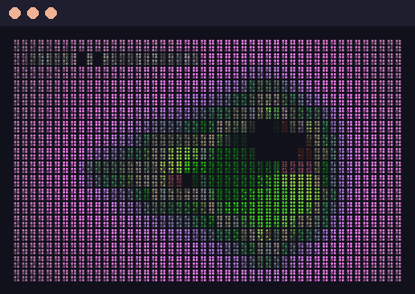
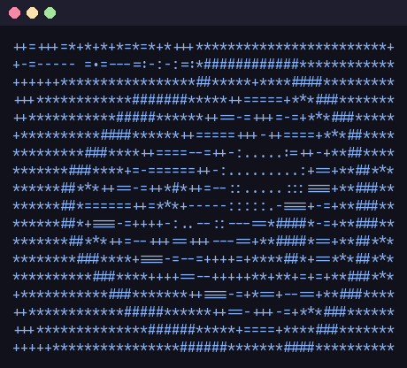
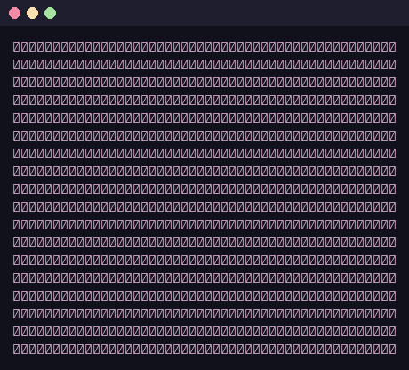
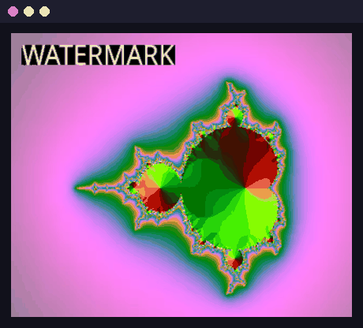

# motionfetch

Turn **videos and images into terminal animations** — and run them beside
[fastfetch](https://github.com/fastfetch-cli/fastfetch), spinning in place like
the classic donut, until you press a key.



fastfetch can't animate: it prints once and exits. motionfetch composes the two
halves itself — your animation on the left, `fastfetch --logo none` on the
right — and redraws the block in place. Any keypress (or Ctrl+C) stops it.

## Features

- **Convert anything**: mp4/mkv/webm/mov videos, GIFs, or still images.
- **GUI or CLI**: a Qt interface (`motionfetch gui`) where cropping is
  dragging a box over the video and the preview plays live — or do it all
  with flags from the terminal.
- **Five looks**: truecolor pixel `blocks`; `dots`, a dense colored
  dot-matrix like a tiny OLED screen; classic `ascii` ramp; high-detail
  `braille` (ordered dithering, tinted with your theme's accent at play time)
  — or `image`, the real untouched pixels, drawn with the kitty graphics
  protocol for terminals that support it (kitty, ghostty).
- **Background removal**: pick the background color (an eyedropper in the
  GUI, `--bg-color` in the CLI) and it disappears — empty cells in the text
  styles, true transparency in `image`.
- **Retime while converting**: `--speed 2` plays twice as fast, `0.5` half.
- **Two stock animations out of the box**: the classic `donut`, and `logo` —
  the motionfetch M drawing itself. They're created on first run; everything
  else comes from your own videos and images.
- **Crop before converting**: `--crop-top 15%` drops a caption or watermark
  without opening a video editor.
- **A library, not a one-off**: animations are stored by name; list, play,
  rename, remove.
- **One command per animation**: `motionfetch link donut fastfetch_1` installs
  a `fastfetch_1` command — make as many as you like and switch between them.
- **Export previews**: render any animation to a `.gif` or `.png` (that's how
  every image in this README was made).



## Install

Needs Python ≥ 3.9 and, for video conversion, `ffmpeg`.

```bash
pipx install git+https://github.com/0980491/motionfetch
```

(or `pip install --user git+…`, or clone and `pip install .`)

For the GUI too, install the `gui` extra:

```bash
pipx install 'motionfetch[gui] @ git+https://github.com/0980491/motionfetch'
```

On Arch: `sudo pacman -S --needed ffmpeg python-pipx` first.

## The GUI

`motionfetch gui` (or `motionfetch-gui`) opens a Qt interface: open a video
(**it plays right there** while you set things up), **drag a box over the
frame to crop**, **click the background color to key it out**, tweak
style/width/fps/speed, watch the converted preview play live, and save.
The Library tab plays everything you've made, creates the per-animation
commands, copies the command to the clipboard, exports, deletes.

Details it takes care of on its own: it installs a **menu launcher** on first
run, uses the KDE file dialog when `kdialog` is available, and has **dark and
light themes** (button in the top-right corner; your choice is remembered).



Cropping a caption out of a GIF, with the converted preview playing live:



## Quick start

```bash
motionfetch list                  # first run creates the stock: donut + logo
motionfetch fetch donut           # spin it beside fastfetch — any key stops it
motionfetch add cool-video.mp4    # convert a video (shows a preview, then asks)
motionfetch                       # interactive browser of your library
```

## Converting videos and images

```bash
motionfetch add clip.mp4 --name rain --width 48 --fps 15
motionfetch add clip.mp4 --style ascii --gamma 0.6      # tintable text look
motionfetch add photo.png --style braille --invert
motionfetch add clip.mp4 --start 12 --duration 6        # just that section
motionfetch add clip.mp4 --speed 2                      # twice as fast
motionfetch add clip.mp4 --style dots \
    --bg-color '#00b140' --bg-tolerance 20              # drop the greenscreen
```

`add` shows a live preview and asks before saving; `--no-preview` skips that.

### Cropping

If the source has a caption, watermark, or letterboxing you don't want, crop it
at convert time — each flag takes pixels or a percentage:

```bash
motionfetch add clip.mp4 --crop-top 15% --crop-bottom 40
motionfetch add clip.mp4 --crop-left 10% --crop-right 10%
```

### Styles

| style | color | best for |
| --- | --- | --- |
| `blocks` | truecolor, 2 pixels per cell | video, photos (default) |
| `dots` | truecolor dot-matrix, 8 dots per cell | the small-OLED look |
| `ascii` | mono, tinted at play time | logo-like sources, theme integration |
| `ascii-color` | truecolor characters | colorful sources with a retro look |
| `braille` | mono, tinted at play time | line art, high detail |
| `image` | the real pixels, not characters | kitty/ghostty terminals only |

The same video across styles:

| `blocks` | `dots` |
| --- | --- |
|  |  |

| `ascii` | `braille` |
| --- | --- |
|  |  |

| `image` | |
| --- | --- |
|  | |

### Removing the background

`ascii` and friends drop dark pixels on their own, but that only works when
the background *is* dark (or bright, with `--invert`). For any other
background, key it out by color: in the GUI press **Pick…** and click the
background on the image; in the CLI pass `--bg-color '#rrggbb'`.
`--bg-tolerance` controls how far a pixel may drift from that color and
still be removed. In the `image` style the removed area becomes real
transparency, so the terminal shows through.

Mono animations pick their tint from `$MOTIONFETCH_TINT`, then
`~/.config/quickshell/colors.json` (matugen setups), then a default blue —
or pass `--tint '#a6e3a1'` explicitly.

## Playing

```bash
motionfetch play logo                 # fullscreen loop, any key stops it
motionfetch fetch logo                # beside fastfetch
motionfetch fetch logo   --cmd nitch  # beside any other fetch tool
motionfetch fetch logo   --secs 5     # stop by itself after 5 s
motionfetch fetch logo   --once       # single static frame (for scripts)
```

If the terminal is too narrow for the pair, motionfetch prints the info box
alone instead of letting the animation wrap.

## Multiple animations, multiple commands

```bash
motionfetch link donut                # installs `fastfetch-donut`
motionfetch link logo   fastfetch_1   # or name it whatever you want
motionfetch link logo --play          # command that plays it fullscreen
motionfetch unlink fastfetch_1
```

Links are tiny scripts in `~/.local/bin`, marked so `unlink` refuses to touch
anything it didn't create. `motionfetch list` shows which animation each
command points to. To make plain `fastfetch` animated, add an alias to your
shell rc:

```bash
alias fastfetch='motionfetch fetch donut'
```

## Exporting previews

```bash
motionfetch export donut donut.gif
motionfetch export donut still.png
motionfetch export donut hero.gif --fetch    # composed beside fastfetch
```

## How it works

- Videos are decoded by ffmpeg (crop → retime → scale in one pass) and
  streamed as raw RGB into the renderer; images go through Pillow; the
  per-pixel math (luminance, dithering, color keying) is vectorized numpy.
- `blocks` prints `▀` with a truecolor foreground/background per half-cell —
  two pixels per character.
- Frames are stored as plain text files in
  `~/.local/share/motionfetch/<name>/`, every line padded to the same width,
  so playback is just *print block, cursor up, print next block*.
- `fetch` captures `fastfetch --logo none --pipe false`, measures the box with
  the escapes stripped, and glues it to every frame up front — the loop itself
  does no work but printing.

## Credits

The "M" in the app icon and splash animation is the
[Letter M Logo](https://logowik.com/letter-m-logo-vector-30824.html) from
logowik.com, rendered as ASCII by motionfetch itself.

## License

MIT
