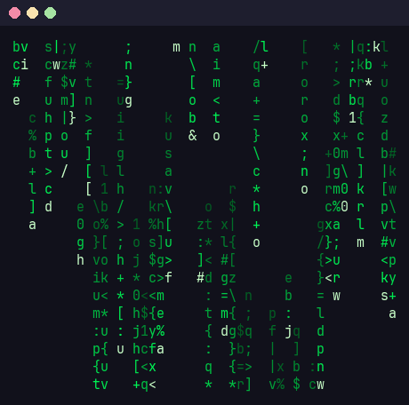

# motionfetch

Turn **videos and images into terminal animations** — and run them beside
[fastfetch](https://github.com/fastfetch-cli/fastfetch), spinning in place like
the classic donut, until you press a key.


fastfetch can't animate: it prints once and exits. motionfetch composes the two
halves itself — your animation on the left, `fastfetch --logo none` on the
right — and redraws the block in place. Any keypress (or Ctrl+C) stops it.

## Features

- **Convert anything**: mp4/mkv/webm/mov videos, GIFs, or still images.
- **Three looks**: truecolor pixel `blocks`, classic `ascii` ramp, or
  high-detail `braille` — ascii and braille are plain text, tinted with your
  theme's accent color at play time.
- **Built-in generators**: `donut`, `matrix` (digital rain), `cube` — no video
  needed.
- **Crop before converting**: `--crop-top 15%` drops a caption or watermark
  without opening a video editor.
- **A library, not a one-off**: animations are stored by name; list, play,
  rename, remove.
- **One command per animation**: `motionfetch link donut fastfetch_1` installs
  a `fastfetch_1` command — make as many as you like and switch between them.
- **Export previews**: render any animation to a `.gif` or `.png` (that's how
  every image in this README was made).

| `matrix` generator | video → `blocks` | video → `braille` |
| --- | --- | --- |
|  |  |  |

## Install

Needs Python ≥ 3.9 and, for video conversion, `ffmpeg`.

```bash
pipx install git+https://github.com/0980491/motionfetch
```

(or `pip install --user git+…`, or clone and `pip install .`)

On Arch: `sudo pacman -S --needed ffmpeg python-pipx` first.

## Quick start

```bash
motionfetch generate donut        # create the classic torus
motionfetch fetch donut           # spin it beside fastfetch — any key stops it
motionfetch add cool-video.mp4    # convert a video (shows a preview, then asks)
motionfetch                       # interactive browser of your library
```

## Converting videos and images

```bash
motionfetch add clip.mp4 --name rain --width 48 --fps 15
motionfetch add clip.mp4 --style ascii --gamma 0.6      # tintable text look
motionfetch add photo.png --style braille --invert
motionfetch add clip.mp4 --start 12 --duration 6        # just that section
```

`add` shows a live preview and asks before saving; `--no-preview` skips that.

### Cropping

If the source has a caption, watermark, or letterboxing you don't want, crop it
at convert time — each flag takes pixels or a percentage:

```bash
motionfetch add clip.mp4 --crop-top 15% --crop-bottom 40
motionfetch add clip.mp4 --crop-left 10% --crop-right 10%
```

### Styles

| style | color | best for |
| --- | --- | --- |
| `blocks` | truecolor, 2 pixels per cell | video, photos (default) |
| `ascii` | mono, tinted at play time | logo-like sources, theme integration |
| `ascii-color` | truecolor characters | colorful sources with a retro look |
| `braille` | mono, tinted at play time | line art, high detail |

Mono animations pick their tint from `$MOTIONFETCH_TINT`, then
`~/.config/quickshell/colors.json` (matugen setups), then a default blue —
or pass `--tint '#a6e3a1'` explicitly.

## Playing

```bash
motionfetch play matrix               # fullscreen loop, any key stops it
motionfetch fetch matrix              # beside fastfetch
motionfetch fetch matrix --cmd nitch  # beside any other fetch tool
motionfetch fetch matrix --secs 5     # stop by itself after 5 s
motionfetch fetch matrix --once       # single static frame (for scripts)
```

If the terminal is too narrow for the pair, motionfetch prints the info box
alone instead of letting the animation wrap.

## Multiple animations, multiple commands

```bash
motionfetch link donut                # installs `fastfetch-donut`
motionfetch link matrix fastfetch_1   # or name it whatever you want
motionfetch link cube --play          # command that plays it fullscreen
motionfetch unlink fastfetch_1
```

Links are tiny scripts in `~/.local/bin`, marked so `unlink` refuses to touch
anything it didn't create. `motionfetch list` shows which animation each
command points to. To make plain `fastfetch` animated, add an alias to your
shell rc:

```bash
alias fastfetch='motionfetch fetch donut'
```

## Exporting previews

```bash
motionfetch export donut donut.gif
motionfetch export donut still.png
motionfetch export donut hero.gif --fetch    # composed beside fastfetch
```

## How it works

- Videos are decoded by ffmpeg (crop → fps → scale in one pass) and streamed
  as raw RGB into the renderer; images go through Pillow.
- `blocks` prints `▀` with a truecolor foreground/background per half-cell —
  two pixels per character.
- Frames are stored as plain text files in
  `~/.local/share/motionfetch/<name>/`, every line padded to the same width,
  so playback is just *print block, cursor up, print next block*.
- `fetch` captures `fastfetch --logo none --pipe false`, measures the box with
  the escapes stripped, and glues it to every frame up front — the loop itself
  does no work but printing.

## License

MIT
